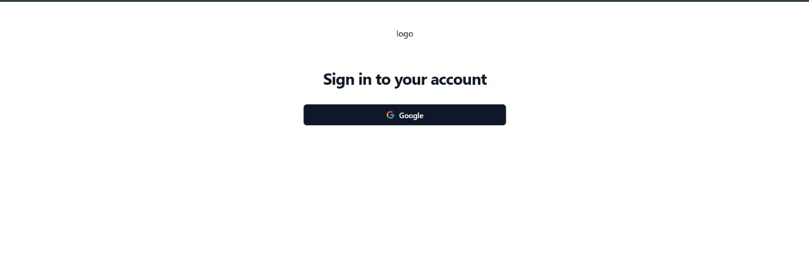
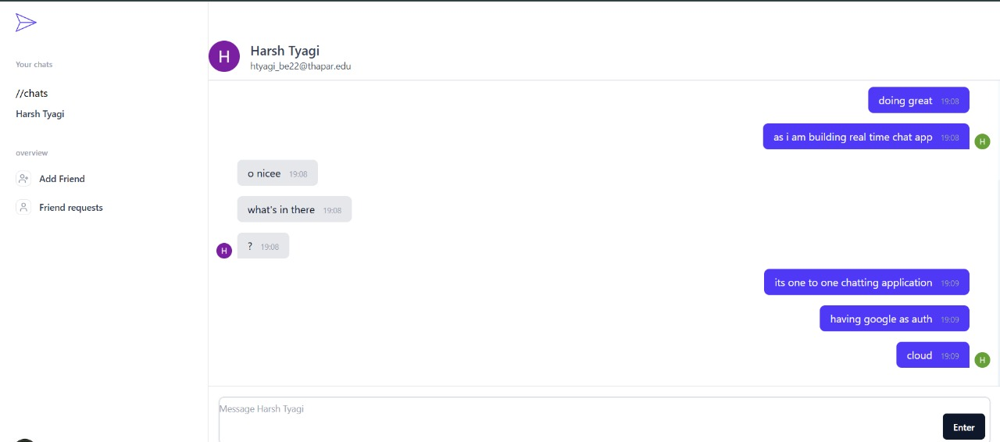
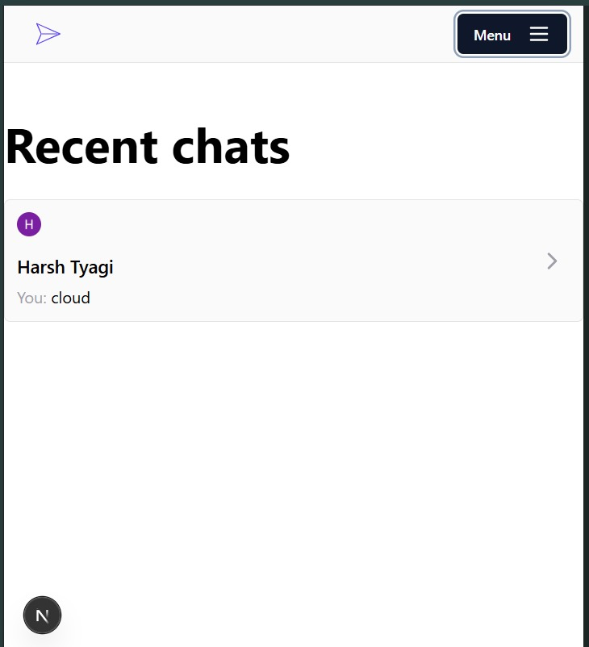
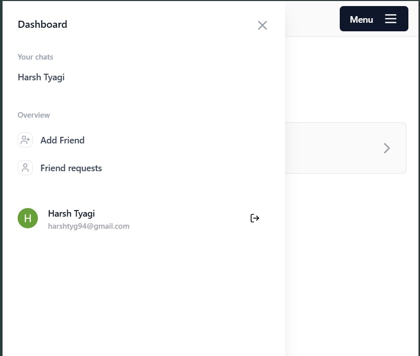

# 💬 VibeChat


> A real-time chat application with Google OAuth, live friend requests, and responsive UI — built with cutting-edge web technologies.

---

## 🚀 Features

- ✅ **Real-Time Messaging** using WebSockets and Pusher
- 🔐 **Google OAuth Authentication** via NextAuth
- 👥 **Friend Request System** with Accept/Deny functionality
- 🔄 **Presence Indicators** and Message Delivery Status
- 📱 **Fully Responsive UI** for Mobile and Desktop
- 📦 **Session Handling and Caching** using Upstash Redis
- ✅ **Form Validation** using Zod + React Hook Form
- 🌗 **Skeleton Loaders**, Toast Notifications, and Autosizing Textareas

---

## 🛠️ Tech Stack

- **Framework**: [Next.js 13.2.4](https://nextjs.org/)
- **Language**: [TypeScript 4.9.5](https://www.typescriptlang.org/)
- **Styling**: [TailwindCSS 3.4.17](https://tailwindcss.com/), [Headless UI](https://headlessui.dev/)
- **Auth**: [NextAuth](https://next-auth.js.org/) with Google OAuth
- **Realtime**: [WebSockets](https://developer.mozilla.org/en-US/docs/Web/API/WebSockets_API), [Pusher](https://pusher.com/)
- **State & Forms**: [React Hook Form](https://react-hook-form.com/), [Zod](https://zod.dev/)
- **Utilities**: [Upstash Redis](https://upstash.com/), [Axios](https://axios-http.com/), [Date-fns](https://date-fns.org/)
- **UI Enhancements**: [Lucide Icons](https://lucide.dev/), [React Hot Toast](https://react-hot-toast.com/), [React Skeleton Loader](https://github.com/dvtng/react-loading-skeleton), [React Textarea Autosize](https://github.com/Andarist/react-textarea-autosize)

---

## 📸 Screenshots

| Login Page | Chat Interface | Mobile View |
|------------|----------------|-------------|
|  |  |  |  |

---

## 📦 Installation

```bash
# Clone the repository
git clone https://github.com/Harsh-tyagi94/vibechat.git
cd vibechat

# Install dependencies
npm install

# Setup environment variables
cp .env.example .env
# Fill in the required values
GOOGLE_CLIENT_ID=
GOOGLE_CLIENT_SECRET=

NEXTAUTH_SECRET=
NEXTAUTH_URL=http://localhost:3000

UPSTASH_REDIS_REST_URL=
UPSTASH_REDIS_REST_TOKEN=

PUSHER_APP_ID=
PUSHER_KEY=
PUSHER_SECRET=
NEXT_PUBLIC_PUSHER_CLUSTER=
NEXT_PUBLIC_PUSHER_KEY=
# Fill in your Google OAuth keys, Pusher keys, and Upstash Redis config in .env

# Run the development server
npm run dev
